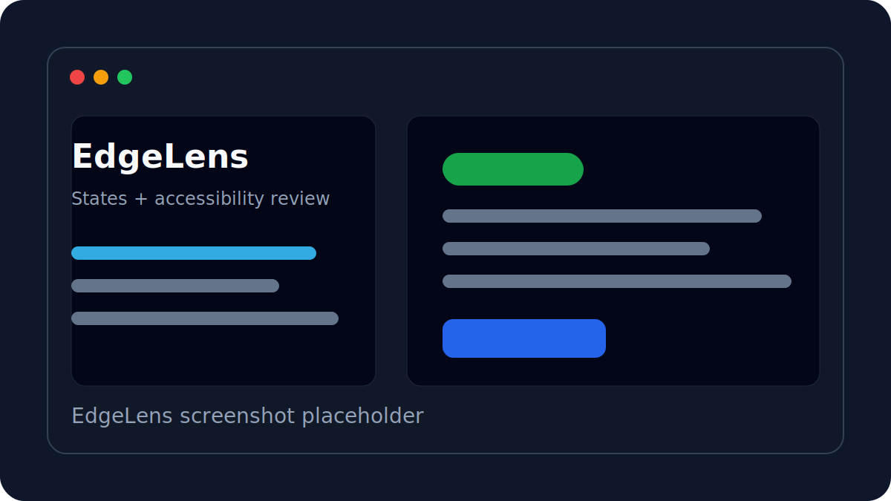

# EdgeLens

Local deterministic pre-flight checker for generated React/shadcn UI.

EdgeLens helps catch missing loading, empty, error, disabled, focus, active, and selected-style states — plus common shadcn/Radix accessibility gotchas — before components ship. Paste or load a React example, run the analyzer, force non-happy-path states in the preview, and review rule-based findings. Everything runs client-side; no backend, database, or product-side LLM calls.

**Demo story:** The component looked done on the happy path until EdgeLens forced the states AI forgot.

**MVP status:** EdgeLens is a rule-based pre-flight checker for local design and engineering review. It can miss issues and produce false positives. It does not certify WCAG compliance or replace manual keyboard testing, screen-reader testing, axe, Storybook, or full QA.

## Screenshot placeholder



## Why EdgeLens exists

AI-generated React/shadcn components often look finished on the default path while skipping the states users hit next: loading, empty, error, disabled, weak focus-visible, hover/active/selected, and a handful of shadcn/Radix composition details (icon-only names, Dialog title/description gaps, suspicious primitives).

EdgeLens narrows to that wedge: a deterministic, client-side sanity check before ship — not a broad accessibility product.

## What it checks

State completeness is the hero feature. Accessibility and composition checks are a supporting layer.

1. **State completeness** — Missing loading, empty, error, disabled, focus-visible, hover/active/selected-style states; forced state preview so gaps are visible.
2. **Static JSX / shadcn checks** — Icon-only buttons without accessible names, Dialog/DialogTitle/DialogDescription issues, suspicious Radix/shadcn composition patterns.
3. **Preview DOM checks** — Browser-side checks against the simulated preview DOM (axe-core where available). Labeled as preview checks, not certification.
4. **Rule-based fix suggestions** — Copyable before/after templates tied to deterministic rules.

## What it is not

Do not treat EdgeLens as:

- a broad accessibility auditor
- a WCAG checker or compliance certifier
- a Storybook replacement
- an axe alternative
- a generic React analyzer
- an AI code-review tool

Also:

- It **does not execute arbitrary pasted JSX** as application code.
- It **does not use product-side LLM/API calls**; the MVP runs locally in the browser.
- It **does not generate perfect source diffs**; fixes are rule-based suggestions and templates.
- It **does not replace manual QA** across real devices, browsers, assistive technologies, or product states.

## Related ecosystem / prior art

EdgeLens sits beside established tools — it does not replace them:

- **[axe-core](https://github.com/dequelabs/axe-core) / axe DevTools** — Mature accessibility engines for automated WCAG-oriented checks. EdgeLens may use axe-core on the *simulated preview DOM* as a supporting signal; it is not an axe product or substitute.
- **[eslint-plugin-jsx-a11y](https://github.com/jsx-eslint/eslint-plugin-jsx-a11y)** — Lint-time JSX accessibility rules in the editor/CI. Complementary static guardrail.
- **[Storybook](https://storybook.js.org/) accessibility and interaction testing** — Component workshop with a11y addons and interaction tests. EdgeLens is a lightweight pre-flight pass, not a Storybook replacement.
- **Storybook pseudo-state tooling** — Force hover/focus/active in stories. EdgeLens similarly forces states in a local preview for generated components.
- **[Radix UI](https://www.radix-ui.com/)** — Accessible primitive layer many shadcn components build on. EdgeLens flags common composition mistakes around those primitives.
- **[React Aria](https://react-spectrum.adobe.com/react-aria/)** — Adobe’s accessible component hooks/components. Different stack; same problem space of interaction and a11y correctness.
- **[shadcn/ui](https://ui.shadcn.com/)** — Copy-paste component system EdgeLens is optimized to review.
- **[Polypane](https://polypane.app/) / [WAVE](https://wave.webaim.org/) / [Accessibility Insights](https://accessibilityinsights.io/)** — Browser and page-level accessibility inspection. Broader than EdgeLens’s component pre-flight scope.
- **RegistryDoctor** — Nearby project interest in auditing shadcn registry packages; related ecosystem concern for shadcn quality, different product surface from EdgeLens’s component pre-flight checks.
- **shadcn/improve-style and AI-agent codebase review workflows** — Agent-driven style and review loops for shadcn codebases. EdgeLens stays deterministic and local rather than LLM-driven review.

## Quickstart

```bash
npm install
npm run dev
```

Open [http://localhost:3000](http://localhost:3000) in your browser.

## Local development commands

```bash
npm run dev       # Start the Next.js dev server with Turbopack
npm run lint      # Run ESLint
npm run typecheck # Run TypeScript without emitting files
npm run build     # Build the production app with Turbopack
npm run start     # Serve a completed production build
```

A manual smoke script also exists for the built-in examples:

```bash
npx tsx scripts/smoke-examples.mts
```

## Typical workflow

1. Paste a React/shadcn component or load a built-in example.
2. Run the analyzer.
3. Review **State completeness** first, then Static JSX/shadcn, Preview DOM, and Fixes.
4. Force supported interaction states in the live preview.
5. Copy relevant fix templates and apply them manually in your source.

## Tech stack

- Next.js 15 and React 19
- TypeScript
- Tailwind CSS v4
- shadcn/ui and Radix-style primitives
- `@babel/parser` for static source parsing
- `axe-core` for preview DOM checks where available

## Architecture

EdgeLens is a single-service, client-side web app. There is no backend, database, server-side analysis service, or product-side LLM integration.

At a high level:

- **Input:** Component source is pasted into the browser or selected from local examples.
- **Static analysis:** Parser-driven rules inspect source structure and component patterns.
- **Preview analysis:** The local preview surface exposes DOM information for browser-side checks where possible.
- **Results:** Findings are grouped by state completeness, static JSX/shadcn checks, preview DOM checks, and rule-based fixes.
- **Fix templates:** Suggested fixes are deterministic snippets or explanations tied to rules, not generated source diffs.

## Roadmap

Near-term (in scope for the MVP wedge):

- Broaden coverage for additional shadcn/ui and Radix interaction patterns.
- Improve confidence labels so findings are easier to triage.
- Add more built-in examples that represent realistic product components.
- Expand fix templates with before/after examples.
- Improve preview-state controls for common component variants.

Saved for later (out of MVP scope):

- VS Code integration
- CI integration
- GitHub PR integration
- Storybook integration

## Contributing

Contributions are welcome, especially focused state rules, shadcn/Radix checks, examples, documentation, and small UI polish. Please keep changes aligned with the current MVP constraints: deterministic checks, client-side execution, state completeness as the hero feature, and honest limitation claims.

## License

License placeholder. Add the final open-source license before public launch.
